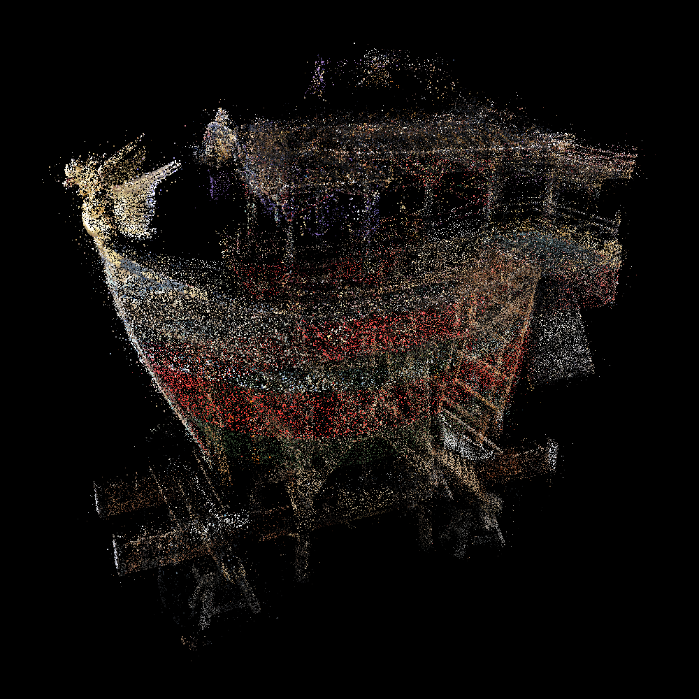
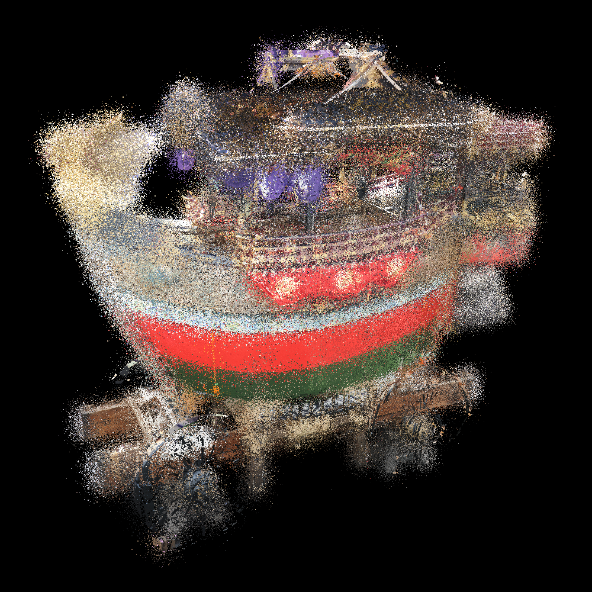
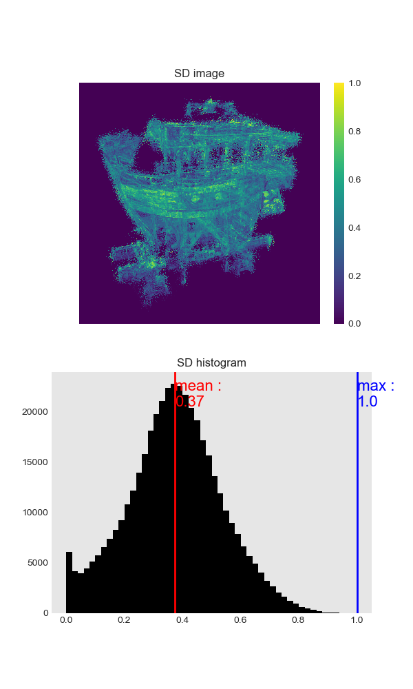
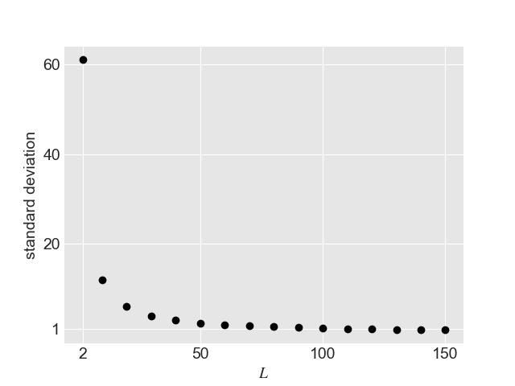

# Analyze_Intermediate_Images

## Overview
#### Step1 :
Create ensemble point clouds(.spbr) from one input point cloud
```
$ ./analyzeIntermediateImages [input_file] [output_path]
```

#### Step2 :
Automatically, snapshot all intermediate images by using `spbr_auto_snap`
```
$ $ python spbr_continuously.py [spbr_file_path] [spbr_header_file] [repeat_level]
```

#### Step3 :
Calculate variance(standard deviation) for each corresponding pixels
```
$ python calc_variance_for_each_pixel.py [input_images_path] [repeat_level] [image_resolution]
```

<br>

## Result
### Intermediate image (L=100)


### Original point cloud (L=1)


### Standard deviation image and histogram


### Transition of standard deviation when increasing repeat level
