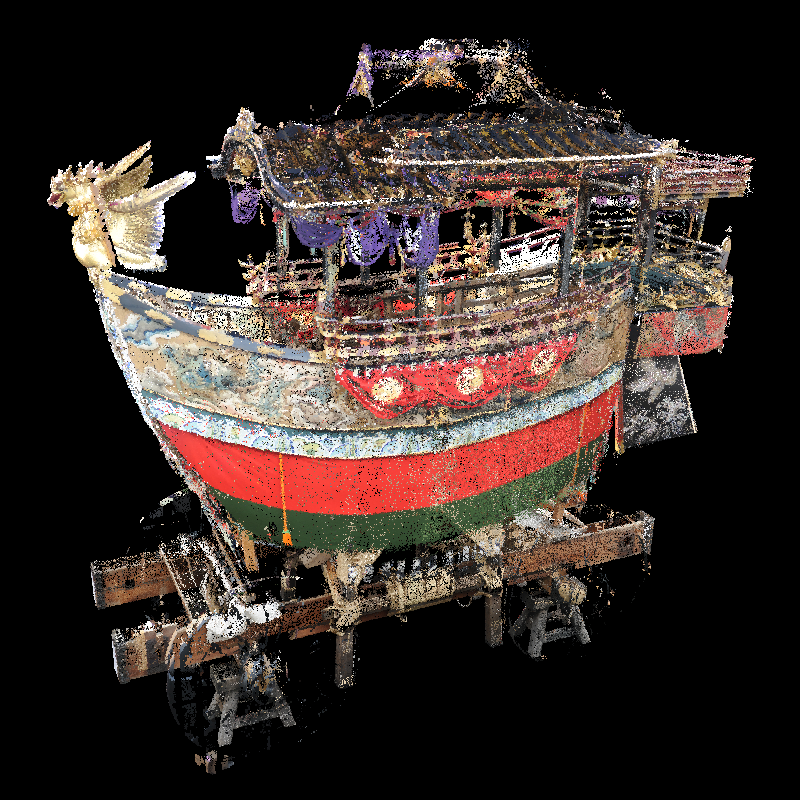
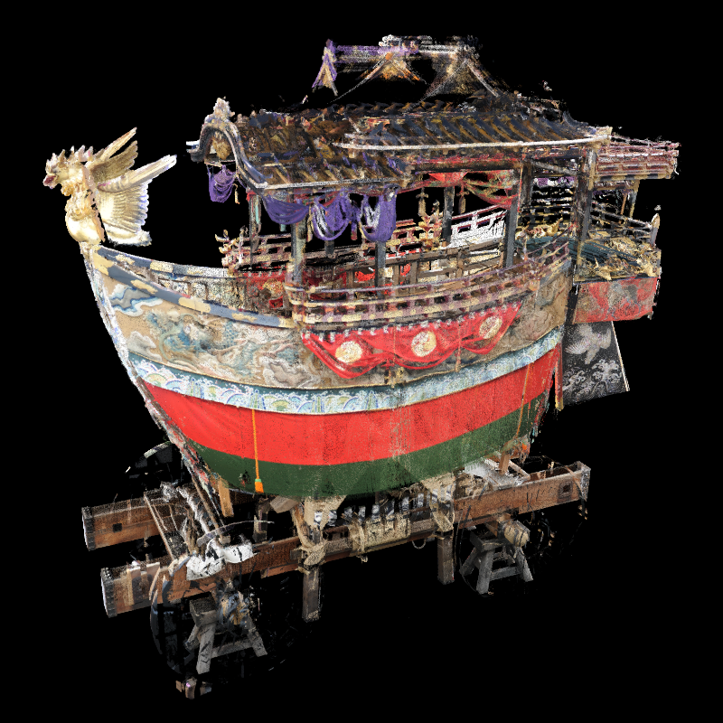

# Analyze_Intermediate_Images

## Overview
- Create ensemble point clouds(.spbr) from one input point cloud.

### Usage
```
$ ./analyzeIntermediateImages [input_file] [output_path]
```

### Example
```
$ ./analyzeIntermediateImages input.ply OUTPUT_DATA/LR10/
```


## Intermediate Images

### ensemble1


### ensemble2


### ensemble3


### ensemble4


### ensemble5


### ensemble6


### ensemble7


### ensemble8


### ensemble9


### ensemble10


## $L=10$ (above ten ensembles)
