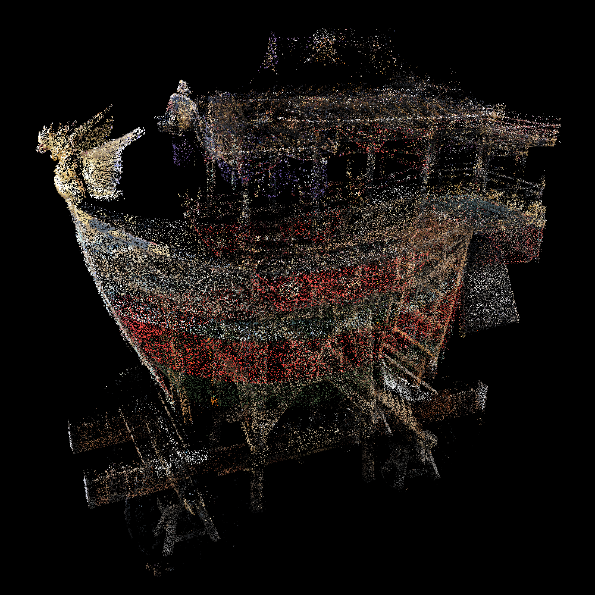
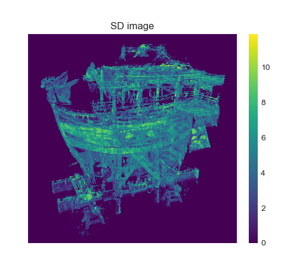
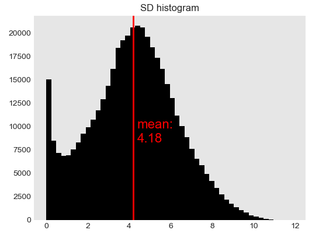

# Analyze_Intermediate_Images

## Overview
1. Create ensemble point clouds(.spbr) from one input point cloud
2. Snapshot all intermediate images automatically by using spbr_auto_snap
3. Calculate variance(or SD) for each corresponding pixel

### Usage
```
$ ./analyzeIntermediateImages [input_file] [output_path]
```

### Example
```
$ ./analyzeIntermediateImages input.ply OUTPUT_DATA/LR10/
```


## Intermediate image (L=100)



## Result
### Standard deviation image
<center>

</center>

### Standard deviation histogram
<center>

</center>