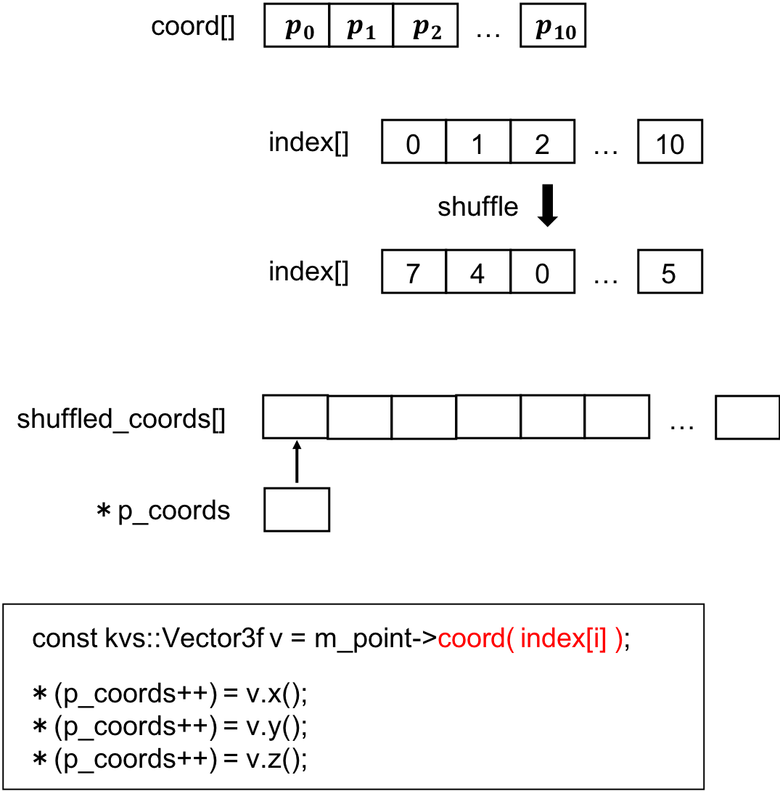

## Shuffle

<br>

### Algorithm
Step1：
Create shuffled indices array

Step2：
Create an empty array to store shuffled coordinates

Step3：
Define a pointer to the empty array(created in Step2)

Step4：
Get one point(Vector3f) using the shuffled indices array(created in Step1)

Step5：
Replace the point(got in Step4) using the pointer(defined in Step3)

<br>

### Source code
``` C++
// Shuffle
void DivideRandomly::shuffle() {
    // kvs::PointObject* point = new kvs::PointObject( *m_ply );
    m_point = new kvs::PointObject( *m_ply );
    std::cout << "Before    : " << m_point->coord( 0 ) << std::endl;

    // Get the number of points in the PointObject.
    const size_t npoints = m_point->numberOfVertices();

    // Create shuffled indices for temporary arrays
    kvs::ValueArray<int> index( npoints ); // We need npoints indices.
    for ( size_t i = 0; i < npoints; i++ ) index[i] = static_cast<int>( i );
    std::random_shuffle( index.begin(), index.end() );

    // Create the shuffled "coords" array.
    {
        // Temporary array for coords (initialized to empty)
        //   x0 y0 z0 x1 y1 z1 x2 y2 z2 ... 
        kvs::ValueArray<kvs::Real32> shuffled_coords( npoints * 3 ); 

        // Define a pointer to an element of the array. 
        //   It is initialized to &(coords[0]).
        kvs::Real32* pcoords = shuffled_coords.pointer(); 

        // Set coords of the index[i]-th point 
        //   as the i-th elemeht of the array.
        for ( size_t i = 0; i < npoints; i++ ) {
            // Set coords of the index[i]-th point 
            //   as the i-th elemeht of the array

            // Get one point(Vector3f) using shuffled index
            const kvs::Vector3f v = m_point->coord( index[i] );

            // Replace
            *(pcoords++) = v.x();
            *(pcoords++) = v.y();
            *(pcoords++) = v.z();
        }

        // Replace coords of the point object with suffled result
        m_point->setCoords( shuffled_coords );
        // std::cout << "test : " << this->coord(0) << std::endl;
    }

    std::cout << "After     : " << m_point->coord( 0 ) << std::endl;


    // Create the shuffled color array.
    if ( m_point->numberOfColors() == 1 ) m_point->setColor( m_point->color() );
    else if ( m_point->numberOfColors() > 1 )
    {
        // Temporary array for colors (initialized to empty)
        //   r0 g0 b0 r1 g1 b1 r2 g2 b2 ... 
        kvs::ValueArray<kvs::UInt8> colors( npoints * 3 );

        // Define a pointer to an element of the array. 
        //   It is initialized to &(colors[0]).
        kvs::UInt8* pcolors = colors.pointer(); 

        // Set colors of the index[i]-th point 
        //   as the i-th elemeht of the array
        for ( size_t i = 0; i < npoints; i++ )
        {
            const kvs::RGBColor c = m_point->color( index[i] );
            *(pcolors++) = c.r();
            *(pcolors++) = c.g();
            *(pcolors++) = c.b();
        }

        // Replace colors of the point object with suffled result
        m_point->setColors( colors );
    }


    // Create the shuffled surface normal array.
    if ( m_point->numberOfNormals() > 1 )
    {
        // Temporary array for normals (initialized to empty)
        //   nx0 ny0 nz0 nx1 ny1 nz1 nx2 ny2 nz2 ... 
        kvs::ValueArray<kvs::Real32> normals( npoints * 3 );

        // Define a pointer to an element of the array. 
        //   It is initialized to &(normals[0]).
        kvs::Real32* pnormals = normals.pointer(); 

        // Set normals of the index[i]-th point 
        //   as the i-th elemeht of the array
        for ( size_t i = 0; i < npoints; i++ )
        {
            const kvs::Vector3f n = m_point->normal( index[i] );
            *(pnormals++) = n.x();
            *(pnormals++) = n.y();
            *(pnormals++) = n.z();
        }

        // Replace normals of the point object with suffled result
        m_point->setNormals( normals );
    }

    m_point->setSize( 1 );

    // Copy the original bounding-box information to the shuffled point set
    m_point->setMinMaxObjectCoords   (    m_point->minObjectCoord(), 
                                        m_point->maxObjectCoord()   );
    m_point->setMinMaxExternalCoords (    m_point->minExternalCoord(), 
                                        m_point->maxExternalCoord() );
} // End shuffle()
```

<br>

### Figure
